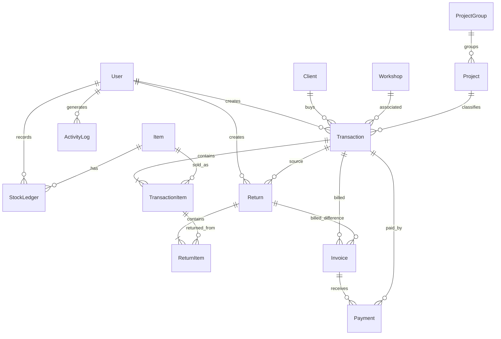
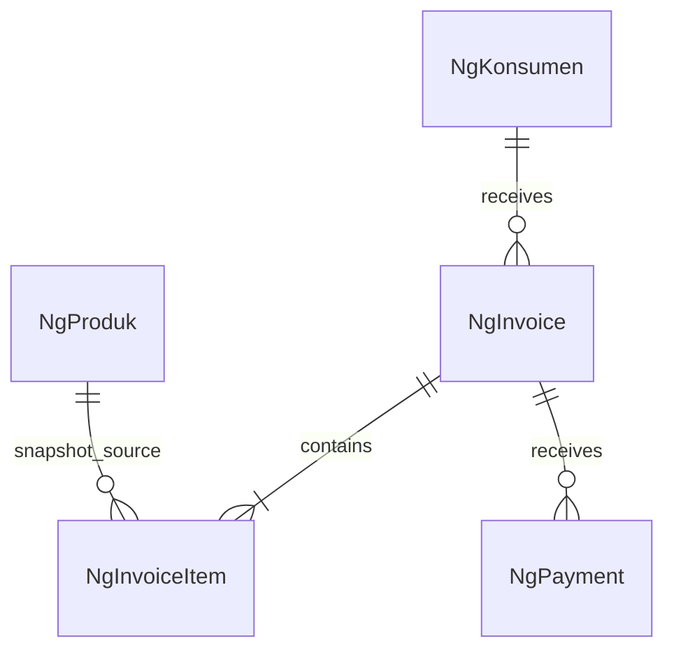

# Entity Relationship

## Gudang/retail

```mermaid
erDiagram
    User ||--o{ Transaction : creates
    User ||--o{ StockLedger : records
    User ||--o{ Return : creates
    User ||--o{ ActivityLog : generates
    Item ||--o{ StockLedger : has
    Transaction ||--|{ TransactionItem : contains
    Item ||--o{ TransactionItem : sold_as
    Client ||--o{ Transaction : buys
    Workshop ||--o{ Transaction : associated
    ProjectGroup ||--o{ Project : groups
    Project ||--o{ Transaction : classifies
    Transaction ||--o{ Return : source
    Return ||--|{ ReturnItem : contains
    TransactionItem ||--o{ ReturnItem : returned_from
    Transaction ||--o{ Invoice : billed
    Return ||--o{ Invoice : billed_difference
    Invoice ||--o{ Payment : receives
    Transaction ||--o{ Payment : paid_by
```

## Non-gudang

```mermaid
erDiagram
    NgKonsumen ||--o{ NgInvoice : receives
    NgInvoice ||--|{ NgInvoiceItem : contains
    NgProduk ||--o{ NgInvoiceItem : snapshot_source
    NgInvoice ||--o{ NgPayment : receives
```

`NgInvoice.userId` dan `NgPayment.userId` adalah integer tanpa relasi Prisma ke `User` pada schema aktif.
