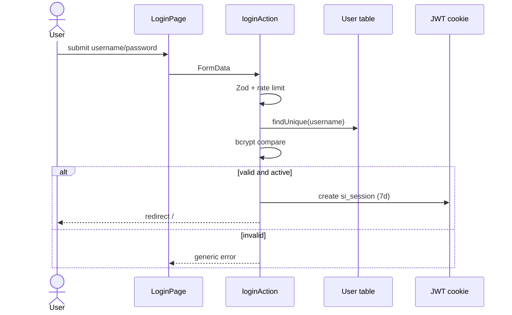

# Login and Session Flow

```mermaid
sequenceDiagram
    actor U as User
    participant F as LoginPage
    participant A as loginAction
    participant DB as User table
    participant J as JWT cookie
    U->>F: submit username/password
    F->>A: FormData
    A->>A: Zod + rate limit
    A->>DB: findUnique(username)
    A->>A: bcrypt compare
    alt valid and active
      A->>J: create si_session (7d)
      A-->>U: redirect /
    else invalid
      A-->>F: generic error
    end
```

Pada request terproteksi, `getSession` memverifikasi JWT lalu membaca ulang user dari DB. User nonaktif atau role/payload invalid menghasilkan session null.
