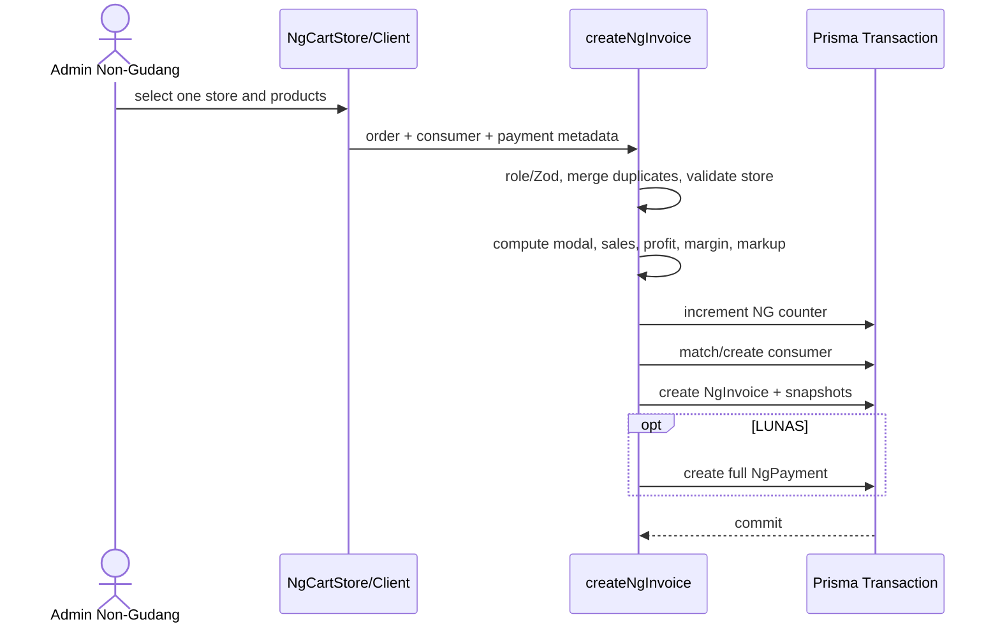

# Non-Warehouse Order Flow

```mermaid
sequenceDiagram
    actor N as Admin Non-Gudang
    participant C as NgCartStore/Client
    participant A as createNgInvoice
    participant DB as Prisma Transaction
    N->>C: select one store and products
    C->>A: order + consumer + payment metadata
    A->>A: role/Zod, merge duplicates, validate store
    A->>A: compute modal, sales, profit, margin, markup
    A->>DB: increment NG counter
    A->>DB: match/create consumer
    A->>DB: create NgInvoice + snapshots
    opt LUNAS
      A->>DB: create full NgPayment
    end
    DB-->>A: commit
```

TEMPO menghasilkan PENDING dan jatuh tempo tujuh hari setelah tanggal invoice. Domain ini tidak memutasi stok gudang.
