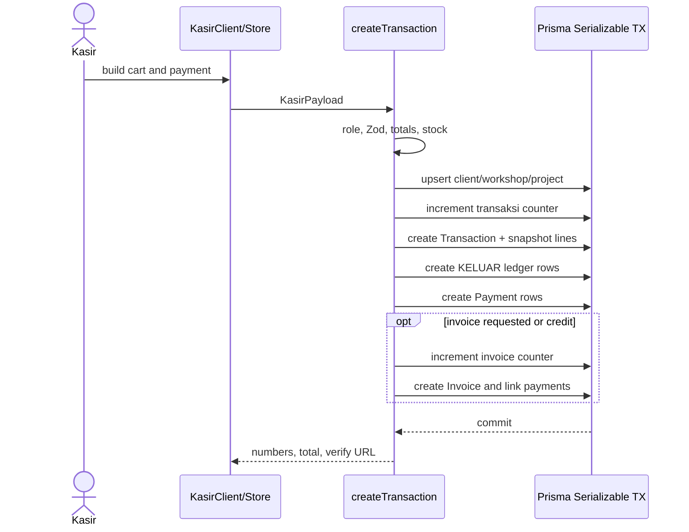

# POS Checkout Flow

```mermaid
sequenceDiagram
    actor K as Kasir
    participant C as KasirClient/Store
    participant A as createTransaction
    participant DB as Prisma Serializable TX
    K->>C: build cart and payment
    C->>A: KasirPayload
    A->>A: role, Zod, totals, stock
    A->>DB: upsert client/workshop/project
    A->>DB: increment transaksi counter
    A->>DB: create Transaction + snapshot lines
    A->>DB: create KELUAR ledger rows
    A->>DB: create Payment rows
    opt invoice requested or credit
      A->>DB: increment invoice counter
      A->>DB: create Invoice and link payments
    end
    DB-->>A: commit
    A-->>C: numbers, total, verify URL
```

Tidak ada pengeluaran stok bila validasi stok gagal. Invoice status awal ditentukan oleh total payment: PENDING, PARTIAL, atau LUNAS.
