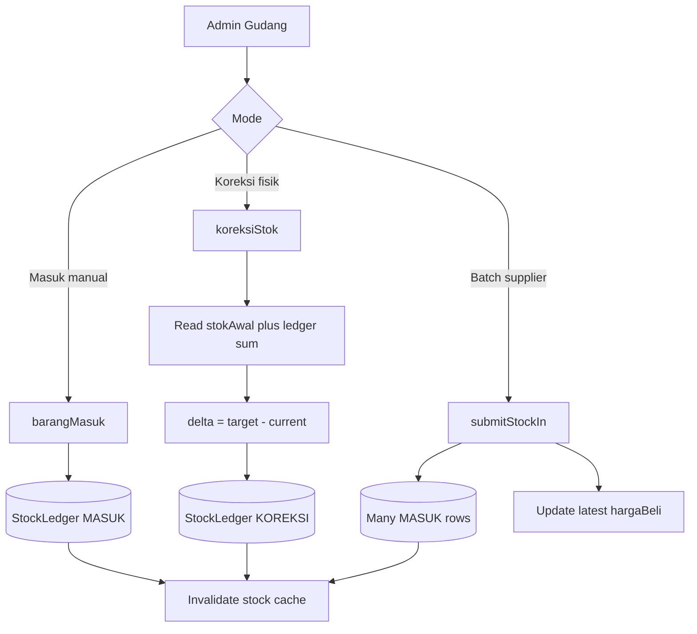

# Stock Mutation Flow

```mermaid
flowchart TD
    U[Admin Gudang] --> M{Mode}
    M -->|Masuk manual| A[barangMasuk]
    M -->|Koreksi fisik| K[koreksiStok]
    M -->|Batch supplier| B[submitStockIn]
    A --> L[(StockLedger MASUK)]
    K --> X[Read stokAwal plus ledger sum]
    X --> D[delta = target - current]
    D --> L2[(StockLedger KOREKSI)]
    B --> L3[(Many MASUK rows)]
    B --> P[Update latest hargaBeli]
    L --> R[Invalidate stock cache]
    L2 --> R
    L3 --> R
```

Koreksi dan batch memakai transaksi Serializable. Semua jalur mencatat activity log setelah write berhasil.
