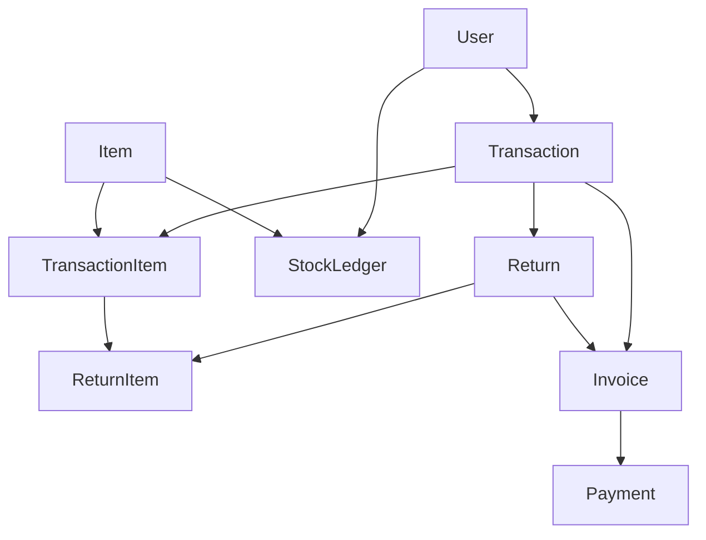
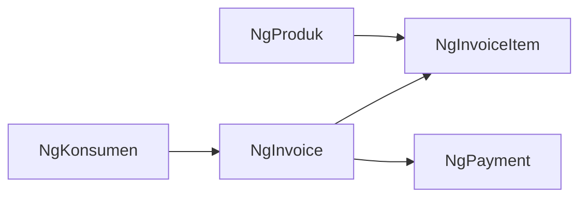

# Database Graph

```mermaid
flowchart TB
    U[User]
    I[Item]
    T[Transaction]
    TI[TransactionItem]
    SL[StockLedger]
    R[Return]
    RI[ReturnItem]
    IV[Invoice]
    P[Payment]
    U --> T
    U --> SL
    T --> TI
    I --> TI
    I --> SL
    T --> R
    R --> RI
    TI --> RI
    T --> IV
    R --> IV
    IV --> P
```

```mermaid
flowchart LR
    NP[NgProduk] --> NII[NgInvoiceItem]
    NK[NgKonsumen] --> NI[NgInvoice]
    NI --> NII
    NI --> NPay[NgPayment]
```

Detail field dan kardinalitas: [[Entity-Relationship]], [[Warehouse-Transaction-Tables]], [[Non-Warehouse-Tables]].
